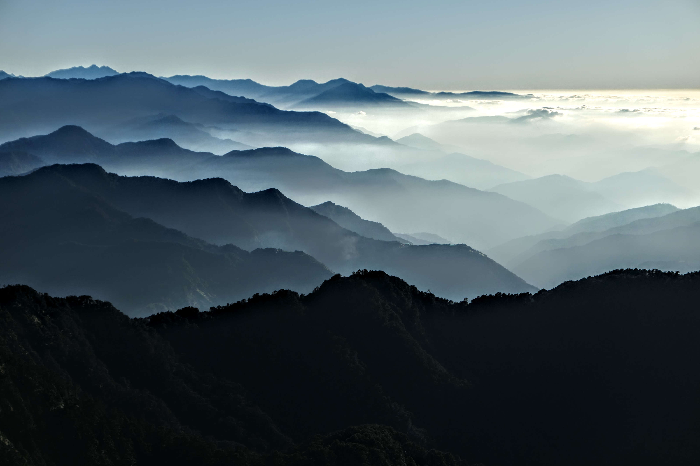
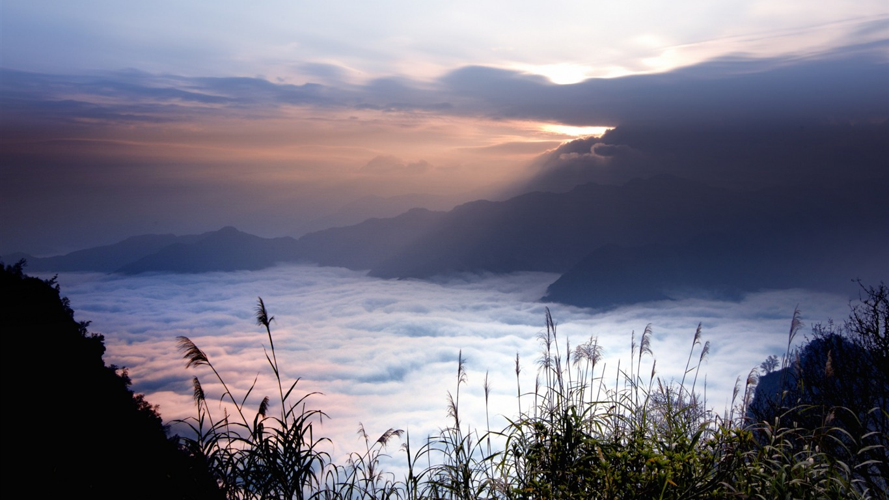
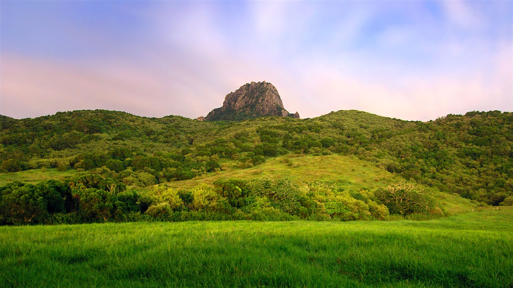

<!DOCTYPE html>
<html lang="en">

<head>
    <meta charset="UTF-8">
    <meta http-equiv="X-UA-Compatible" content="IE=edge">
    <meta name="viewport" content="width=device-width, initial-scale=1.0">
    <link rel="stylesheet" href="style.css">
    <title>我們的山林，大家的山林</title>
    <link rel="stylesheet" href="Resrt.ccs">
</head>

<body>
    

        
 
            
            <nav>
                <a href="index-yama.html">台灣的山林</a>
                <a href="index-about.html">關於健行</a>
                <a href="index-hiking-trail.html">適合健行的山</a>
                <a href="#">會員資料</a>
                <a onclick="change()" id="chg" href="#">深色模式</a>
            </nav>
        
 
    

   
        

            

                

                    
                

                
 
                    
這是一座山

                    <h3>有關於台灣的山</h3>
                

                
 
                    
這是一座山

                    <h3>有關於台灣的山</h3>
                
  
                

                    
                

                

                    
                

                
 
                    
這是一座山

                    <h3>有關於台灣的山</h3>
                

                
 
                    
這是一座山

                    <h3>有關於台灣的山</h3>
                
  
                

                    
                

                    
                

                
 
                    
這是一座山

                    <h3>有關於台灣的山</h3>
                

                
 
                    
這是一座山

                    <h3>有關於台灣的山</h3>
                
  
                

                    
                

            

        

        

            
關於我們美麗的山

        

        

            

                
Hot

                
                

                    玉山是臺灣的最高山，其最高峰玉山主峰海拔3,952.43±0.045公尺，設有一等三角點，百岳之首，位於玉山山脈的核心，在嘉義縣阿里山鄉中山村、南投縣信義鄉東埔村與高雄市桃源區梅山里交界處。為保護玉山及周邊極為珍貴的自然景觀生態及歷史文化資產，在1985年設立玉山國家公園。
                

            

            

                
Hot

                
                

                    合歡山，1960年曾被更名為介壽山，是台灣中央山脈主脊北段的一座高山，主脊的部分位於南投縣仁愛鄉大同村、德鹿谷村、花蓮縣秀林鄉富世村的交界，而合歡山主峰的山頂位在中央山脈主脊往西岔出的支稜上，標高3417公尺，離花蓮縣的邊界約1公里，最高峰位在北合歡山，標高3422公尺。
                

            

            

                
Hot

                
                

                    南湖大山，為臺灣第五高山，中央山脈第三高峰、中央山脈北段的最高峰，海拔3742公尺，設有一等三角點、三等衛星點LP59，臺灣百岳排名第8。處於中央山脈主稜線北段，南湖山群為臺中市、宜蘭縣、花蓮縣的邊界，最高峰南湖大山山頂位於臺中市和平區平等里，東南方距離花蓮縣秀林鄉和平村的邊界約400多公尺，在太魯閣國家公園內。
                

            

            

                
Hot

                
                

                    秀姑巒山，布農族稱為馬霍拉斯山，是台灣中央山脈中段最高山彙中心的一座高山，標高3,825公尺，為中央山脈最高峰，台灣第三高山，僅次於玉山和雪山，山頂設有二等三角點1691號，國土測繪中心最新圖資標記基點西南方約80多公尺處最高峰標高3829公尺，位於南投縣信義鄉東埔村與花蓮縣卓溪鄉立山村的交界，玉山國家公園範圍內。
                

            

            

                
Hot

                
                

                    中央尖山，是臺灣中央山脈北段一座高山，海拔3,698公尺，為中央山脈第四高峰，在著名的百岳中排名第10，山頂設有三等三角點第6015號，位於臺中市和平區平等里與花蓮縣秀林鄉富世村之間，太魯閣國家公園園區內。
                

            

            

                
Hot

                
                

                大霸尖山是臺灣最著名的高山之一，其外型如神工鬼雕天成的孤峰造型，屹立在雪山山脈雪山地壘聖稜線的北緣，標高3,492公尺，泰雅語稱為「Papak
                    waqa（Skaru語系）、 Papak wa'a（Spazi語系）、Papakwa'a（Klapay語系）」，大霸尖山與小霸尖山合稱為「B'bu'
                    Papak」，賽夏語稱為「Kapatalayan」、「Oppeoh-na-boon」，從前漢人以遙望如同一個熬酒桶，稱之為「熬酒桶山」、「酒桶山」，位於新竹縣尖石鄉秀巒村與苗栗縣泰安鄉梅園村之間，即雪霸國家公園中的「霸」，擁有「世紀奇峰」的美譽，在著名的台灣百岳排名28，與中央尖山、達芬尖山合稱三尖。
                

            

        

        

            以上的六座山脈為我們最常見的台灣的山
        

        

            常見的健行步道
        

        

            

                
                
   
                    <h3>忘憂谷步道</h3>
                    <ul>沿著忘憂谷步道走來，可以看到綠草如茵的忘憂谷、波濤洶湧的基隆嶼還有層層疊疊的山脈，當然，也可以下到潮間帶欣賞古老的化石、可愛的蝦兵蟹將，也能觀察特殊的海蝕地形。不僅如此，身邊隨時有各種色彩繽紛的蝴蝶翩然飛舞，抬頭一望，也能看到氣宇軒昂的大冠鷲或黑鳶，簡直是海陸空超值套餐之旅。
                    <li>地點：基隆市中正區</li>
                    <li>全長：1.7公里</li>
                    <li>花費時間：60分鐘</li>
                    <li>難度：低</li>
                    <li>特色：可看山看海，忘憂谷步道的稜頂涼亭及101高地也是看日出、夕陽與夜景的超棒地點，「忘憂」之名果然名符其實！</li>
                    </ul>
                
     
            

            

                
                
   
                    <h3>金明山、柯子林山步道</h3>
                    <ul>金明山、柯子林山步道的景觀毫不遜色！一般多由汐萬路三段的登山口起登，入口設有導覽圖，先爬一段有繩索輔助的陡坡，不久即來到如意湖的三岔路口，先取左前往金明山與柯子林山，一路上以岩稜路為主，幾棵老松迎風而立，偶爾行於內凹的岩壁小徑，經過往柯子林山的岔路後，先登上海拔392公尺的金明山，可飽覽新山、大尖山、五指山、基隆山和無耳茶壺山等環山景色，連汐止地區也盡收眼底！
                        <li>地點：新北市汐止區</li>
                        <li>全長：2公里</li>
                        <li>花費時間：90分鐘</li>
                        <li>難度：低</li>
                        <li>特色：奇石磊磊岩稜路，小巧幽靜如意湖，二葉蒼松來相伴，視野開闊煩惱除。</li>
                    </ul>
                

            

            

                
                

                    <h3>雙流國家森林遊樂區步道群</h3>
                    <ul>雙流因楓港溪上游兩大支流匯集穿越因而得名，溪流為園區帶來充足的水氣，雨季時亦可見幾處自山壁宣洩而下的時雨瀑布。園區內有白榕步道、帽子山登山步道、沿山步道及瀑布步道，各具特色。
                        <li>地點：屏東縣獅子鄉</li>
                        <li>全長：約10公里</li>
                        <li>花費時間：約6-7小時</li>
                        <li>難度：低</li>
                        <li>特色：因地處避風谷地，植被林相茂密多樣，春夏兩季蝴蝶種類豐富，冬季更有紫斑蝶群聚度冬，是南部極佳的賞蝶景點。</li>
                    </ul>
                

            

            

                
                

                    <h3>龍潭小粗坑古道</h3>
                    <ul>小粗坑古道是日據時代沿著小粗坑溪而上、由桃園龍潭運送物資到新竹關西的牛車道。如今古道搖身一變成為賞桐的熱門景點之一，每年四五月桐花盛開時節，古道覆雪、風景如畫，沿途有綠蔭和淙淙溪流相伴，還可視個人體力連走小百岳石門山（一等三角點），環繞一圈後接回小粗坑古道。
                        <li>地點：桃園市龍潭區</li>
                        <li>全長：單程2公里</li>
                        <li>花費時間：90分鐘(往返)</li>
                        <li>難度：低</li>
                        <li>特色：以「花自飄零水自流」的五月飛雪美景聞名，夜晚還可以觀察螢火蟲生態。</li>
                    </ul>
                

            

            

                
                

                    <h3>鹿林山步道</h3>
                    <ul>鹿林山以及鹿林前山不如玉山那麼知名，但是無論是沿途景色或是歷史背景，都非常有特色，是玉山國家公園塔塔加遊憩區步道之一、鹿林山自然公園的一部份、也是林務局劃定的野生動物重要棲息環境。
                        <li>地點：南投縣信義鄉</li>
                        <li>全長：5.5公里</li>
                        <li>花費時間：130分鐘</li>
                        <li>難度：低</li>
                        <li>特色：鹿林山區視野寬廣，適合觀賞日出、雲海、晚霞、以及星空，在這裡就算發呆也心滿意足。行走在鹿林山步道，除了遙想當年的歷史，也別忘了好好欣賞此片美好，拿起相機帶一片風景回家。</li>
                    </ul>
                

            

            

                
                

                    <h3>涼山瀑布步道</h3>
                    <ul>涼山瀑布步道位在屏東東港溪上游的牛角灣溪裡，步道沿溪上行，會通過三層瀑布。 其中，第一層瀑布的路徑平整好走，加上距環山公路也最近最易到達，因此假日常吸引許多遊客在此戲水玩耍。
                        <li>地點：屏東縣瑪家鄉</li>
                        <li>全長：單程2.1公里</li>
                        <li>花費時間：100分鐘（往返）</li>
                        <li>難度：低</li>
                        <li>特色：雄偉的瀑布景觀，及一路伴隨可戲水的清涼溪流。</li>
                    </ul>
                

            

        

        

            

                
                

                    <h3>我是練習範例</h3>
                    
我是內容

                

            

            

                

                    
                    

                        <h3>我是練習範例</h3>
                        
我是內容

                    

                

                

                    
                    

                        <h3>我是練習範例</h3>
                        
我是內容

                    

                

                

                    
                    

                        <h3>我是練習範例</h3>
                        
我是內容

                    

                

                

                    
                    

                        <h3>我是練習範例</h3>
                        
我是內容

                    

                

            

        

        

            

                <h3>關於森林的沐浴</h3>
                <nav>
                    <a href="#" id="">網站目標</a>
                    <a href="#" id="">爬山理念</a>
                    <a href="#" id="">健康宗旨</a>
                </nav>
            

            

                <h3>關於台灣的森林</h3>
                <nav>
                    <a href="#" id="">台灣國家公園</a>
                    <a href="#" id="">知名景點</a>
                    <a href="#" id="">山友的回響</a>
                    <a href="#" id="">山區小常識</a>
                </nav>
            

            

                <h3>關於更多的健行步道</h3>
                <nav>
                    <a href="#" id="">谷關七雄</a>
                    <a href="#" id="">內湖三尖</a>
                    <a href="#" id="">水雲三星</a>
                    <a href="#" id="">武陵四秀</a>
                    <a href="#" id="">五嶽</a>
                </nav>
            

            

                <h3>訂閱愛地球電子報</h3>
                

                   <input type="text">
                   <input type="submit" value="訂閱">
                

            

        

        

            © 2023 Gamania Digital Entertainment Co., Ltd. All Rights Reserved.
        

        
        
    
</body>

</html>
